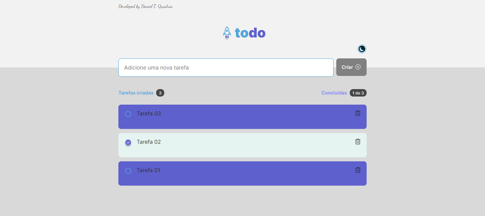

# Challenge 'TO DO Task List' -> ROCKET SEAT: IGNITE!!!

# DESAFIO 'TO DO Lista de Tarefas' -> ROCKET SEAT: IGNITE!!!

Mission accomplished!!!

EN - -> Challenge proposed in Rocket Seat's Ignite trail to develop a task management application.
For the challenge, Rocket Seat provided a suggestive Layout developed by Millena Kupsinskü Martins at Figma.

PT - -> Desafio proposto na trilha Ignite da Rocket Seat para desenvolver uma aplicação de gerenciar tarefas.
Para o desafio a Rocket Seat disponibilizou um Layout sugestivo desenvolvido por Millena Kupsinskü Martins no Figma.

EN - The project:

- It must have an input that receives a text with the title/description of a task to be registered.
- When clicking on 'Create' button, the system must register the new task in the list of tasks with status of not completed.
- In the list of tasks, add two indicators, one that shows the number of registered tasks, and another that shows the number of completed tasks.
- In the task list add the funcionality to mark each as completed or not completed.
- Still in task list Create funcionality to delete each task independently.

PT - O Projeto:

- Deve possuir um input que recebe um texto com o título/descrição de uma tarefa a ser cadastrada.
- Ao clicar no botão 'Criar' o sistema deve cadastrar a nova tarefa na lista de tarefas com o status de não concluída.
- Na lista de tarefas, adicionar dois indicadores, um que mostra o número de tarefas cadastradas e outro que mostra o número de tarefas concluídas.
- Na lista de tarefas adicionar a funcionalidade de marcar cada tarefa como concluída ou não concluída.
- Ainda na lista de tarefas Criar a funcionalidade de excluir cada tarefa independentemente.

# Highlights about the challenge

# Destaques sobre o Desafio

EN - The cool thing about this project was the opportunity to develop all the code from scratch, without follow-up.
I had the opportunity to define when to create each component, how to position them and which properties to use for their styling.
In addition, independently think and develop each function applied to achieve the final objective of the project.

PT - O legal deste projeto foi a oportunidade de desenvolver todo o código do zero, sem acompanhamento.
Tive a oportunidade de definir quando criar cada componente como posicioná-los e quais propriedades utilizar para a sua estilização.
Além disso, pensar e desenvolver de forma independente cada função aplicada para atingir o objetivo final do projeto.

# Personal contribution

# Contribuição pessoal

EN - In addition to the project proposal, I added the functionality that I found very good to develop, the possibility of changing the system theme between the dark theme (initial) and a light theme. Using CSS classes.

PT - Além da proposta do projeto, adicionei a funcionalidade que achei muito bom desenvolver, a possibilidade de alterar o tema do sistema entre o tema escuro (inicial) e um tema claro. Utilizando classes do CSS.

# Tecnologies:

- ReactJS + Vite + Typescript
- Components
- Properties (props)
- React Hooks

* useState
* useEffect

- React rendering flow
- Immutability
- Styling (modules.css)

# Main dependencies:

- phosphor-react 1.4.1
- uuidv4": "^6.2.13"
